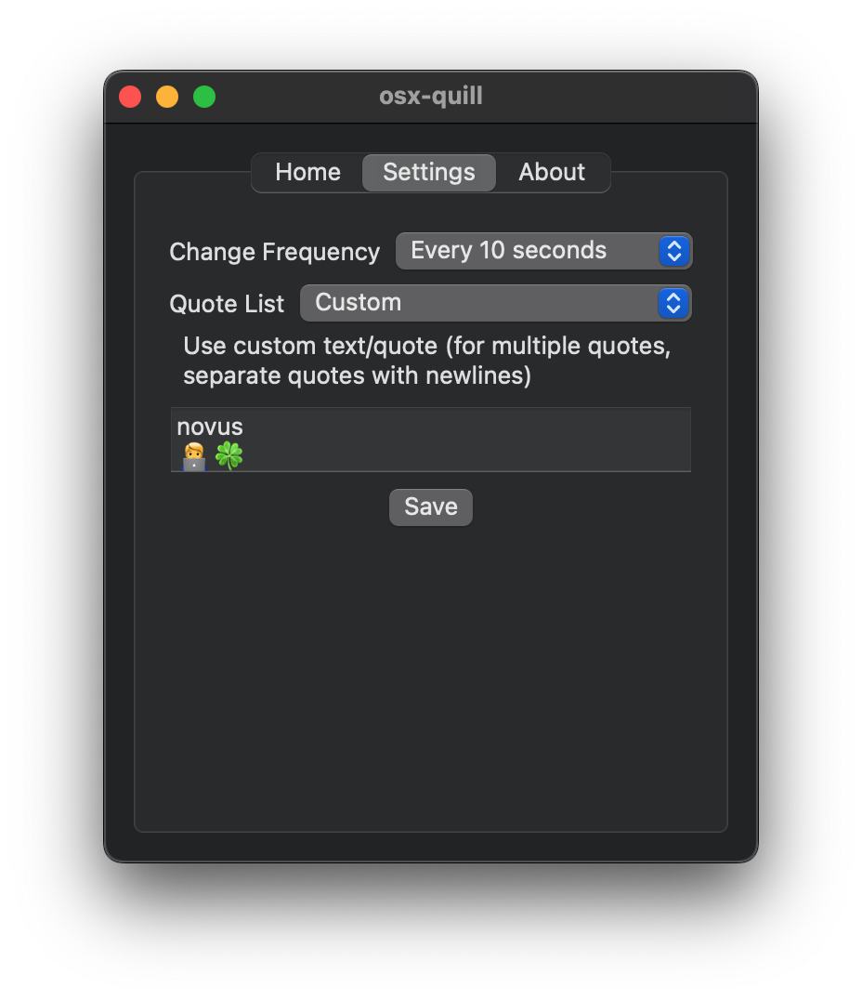

## osx-quill
A simple macOS native app to display motivational quotes or any text on your menu bar. Choose from a selection of preloaded quote lists to stay inspired throughout your day or keep your own text.

### Screenshots

### Todo
- [x] allow custom text
- [x] changing frequency 
- [x] persist settings
- [x] change quote on reboot/wake cycle (maybe in future)

> [!NOTE]
> I created this project for fun to explore SwiftUI, so I didn't spend much time on customizing the design and adding more extra features. It's inspired by an existing app that lets you put text on the MenuBar.
